# Proyectos

  
Hidrología superficial

  
  

    
1. Análisis de Precipitaciones

Descargué datos de precipitación del Servicio Meteorológico Nacional de una estación de la subcuenca de Zapotitlán, Guerrero. Procesé los datos en Python. Hice una serie mensual y anual. También obtuve la precipitación promedio mensual.

**Herramientas:** Python

**Resultado:**

<figure>
  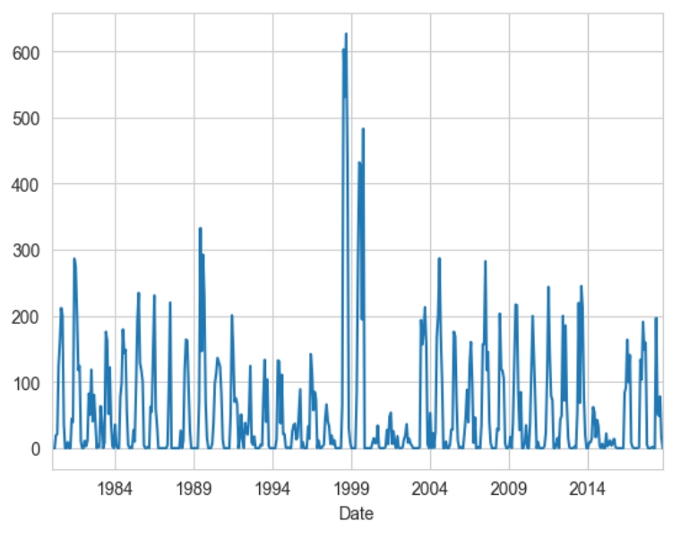
  <figcaption>Precipitación mensual</figcaption>
  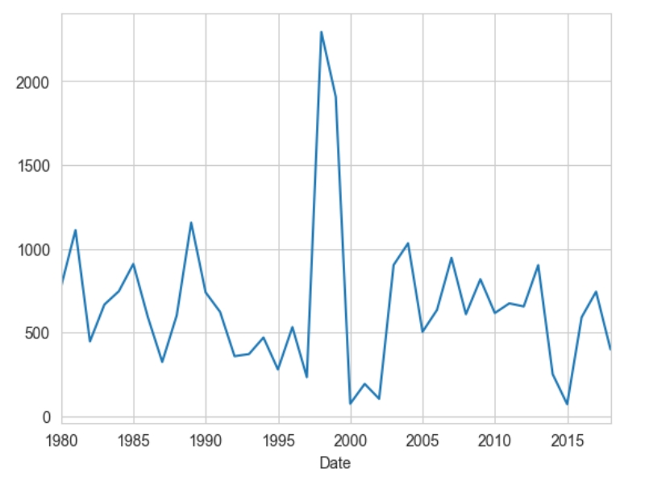
  <figcaption>Precipitación anual</figcaption>
  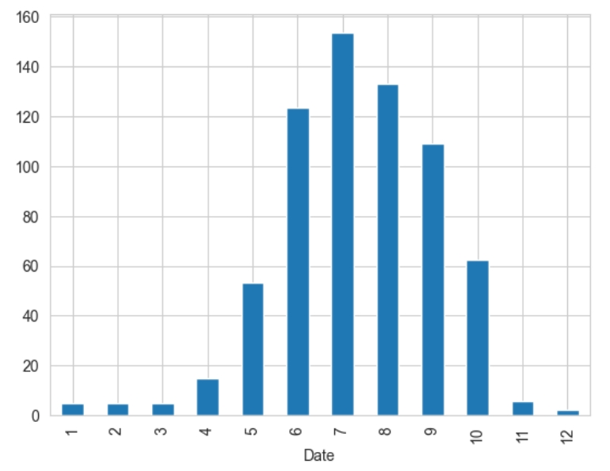
  <figcaption>Precipitación promedio mensual</figcaption>
</figure>
  

  

    
2. Simulación de infiltración

Trabajé con datos de intensidad de lluvia de una estación del Observatorio Hidrológico de Instituto de Ingeniería de la UNAM. Apliqué el método de tasa de infiltración constante para estimar la pérdida de agua por infiltración ante una tormenta severa, asumiendo que el suelo tiene siempre la misma capacidad de infiltración. Convertí las tasas de precipitación y de infiltración a láminas y grafiqué la Curva Masa.

**Herramientas:** Python

**Resultado:**

<figure>
  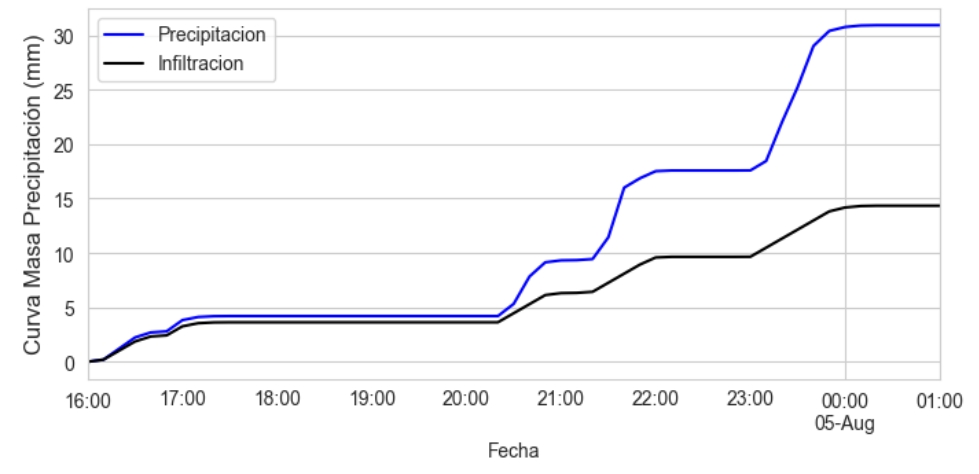
  <figcaption>Curva Masa</figcaption>
</figure>
  

  

    
3. Análisis de caudal

**Herramientas:** Python

**Resultado:**

<figure>
  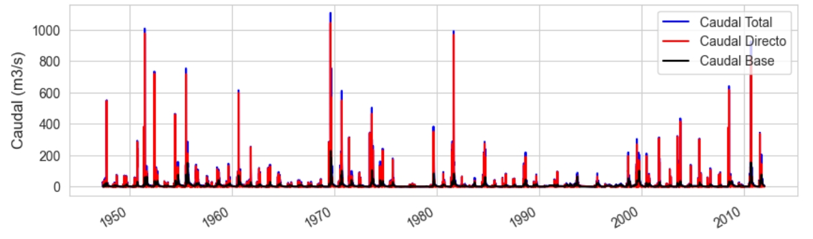
  <figcaption>Caudal a escala diaria</figcaption>
  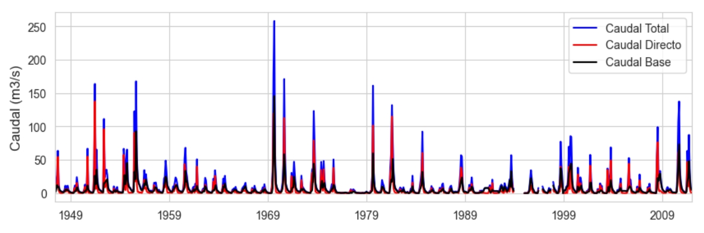
  <figcaption>Caudal a escala mensual</figcaption>
</figure>
  

  

  
Hidrología subterránea

  
  

    
1. Red de flujo

Hice la red de flujo de agua subterránea de la zona de Piedras Negras, Coahuila. Primero obtuve curvas de elevación de nivel estático a partir de una interpolación por el método de kriging, empleando los softwares SGEMS, SAGA GIS y QGIS. Después, elaboré un mapa de la piezometría y la geología de la zona; con base en este mapa dibujé las líneas de flujo.

**Herramientas:** SGeMS, SAGA GIS y QGIS.

**Resultado:**

<figure>
  
  <figcaption>Red de flujo</figcaption>
</figure>
  

  

  
SIG y Percepción Remota

  
  

    
1.	Calibración radiométrica y corrección atmosféricas

Trabajé una imagen Landsat-7 en ENVI. Utilicé las herramientas radiometric calibration y flaash atmospheric correction. Utilicé una combinación RGB (4, 3, 2); se observa la vegetación en tonos rojos y un cuerpo de agua en azul.

**Herramientas:** ENVI

**Resultado:**

<figure>
  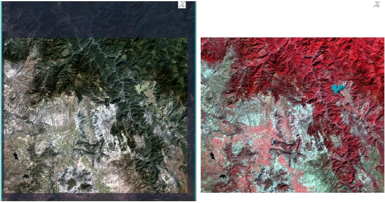
  <figcaption>Red de flujo</figcaption>
</figure>
  

  

    
2. 2.	Clasificación supervisada y no supervisada

Realicé una clasificación supervisada y no supervisada de una escena Landsat 8 del área de la Bahía de San Francisco. La escena pertenece al 3 de marzo de 2015. Realicé esta clasificación en ENVI. Hice los dos tipos de clasificación utilizando la herramienta Classification Workflow. También, obtuve las estadísticas de cada clasificación y calculé el área en hectáreas de cada cobertura.
    
**Herramientas:** ENVI

**Resultado:**

<figure>
  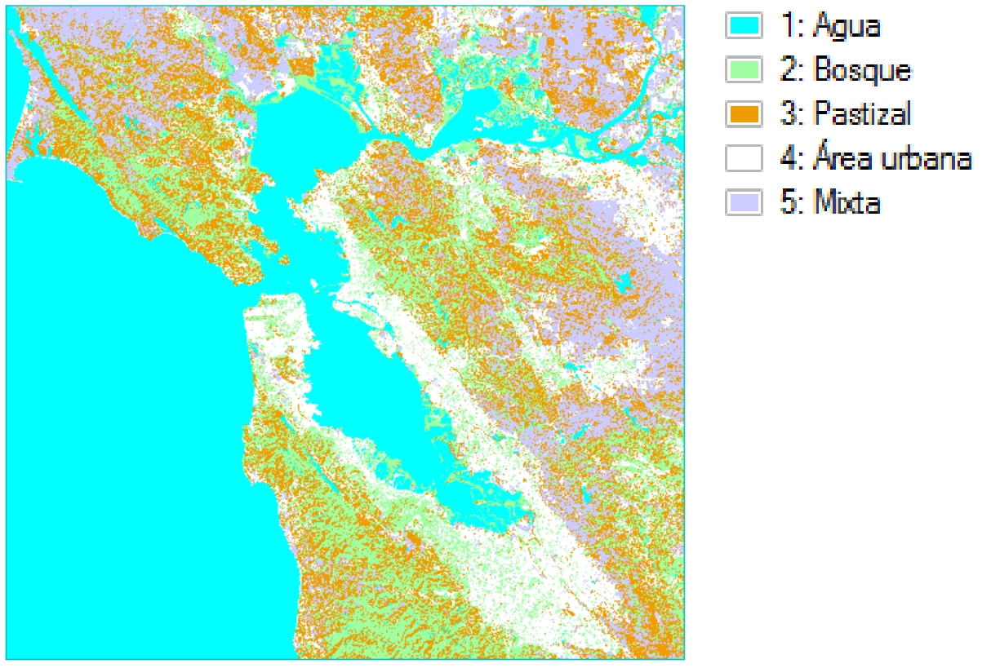
  <figcaption>Clasificación no supervisada</figcaption>
  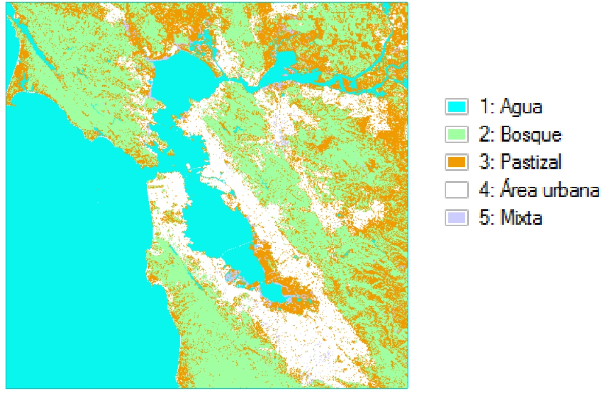
  <figcaption>Clasificación supervisada</figcaption>
</figure>
  

  

    
3. 3.	Digitalización de geomorfología

Digitalicé, manualmente, la geomorfología de la zona fronteriza entre Querétaro e Hidalgo con base en el mapa altimétrico de la zona.

**Herramientas:** QGIS

**Resultado:**

<figure>
  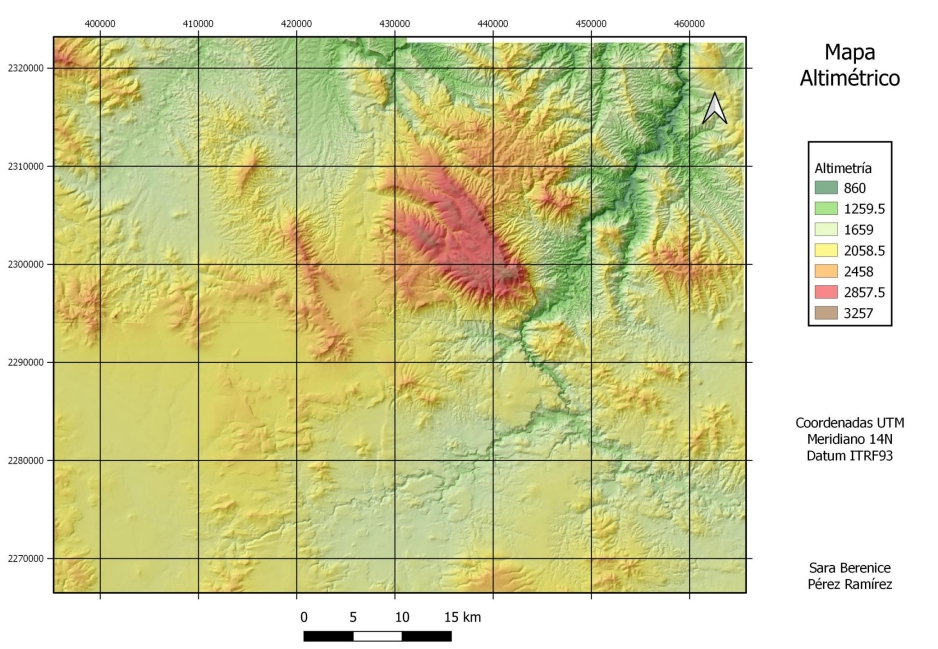
  <figcaption>Mapa altimétrico</figcaption>
  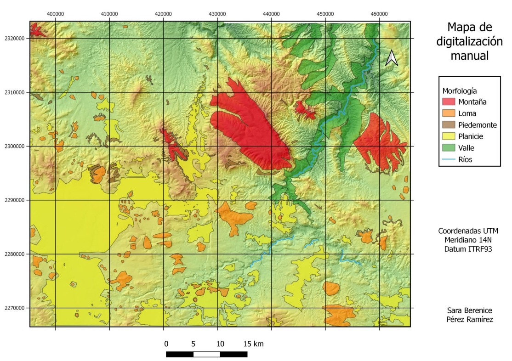
  <figcaption>Mapa geomorfológico</figcaption>
</figure>
  

  

